<!DOCTYPE html>
<html lang="pt-BR">
<head>
    <meta charset="UTF-8">
 
</head>
<body>

<h1>Pipeline de Dados com Telegram</h1>

<h2>Índice</h2>
<ol>
    <li><a href="#introducao">Introdução</a></li>
    <li><a href="#ingestao">Ingestão</a>
        <ul>
            <li><a href="#aws-s3">AWS S3</a></li>
            <li><a href="#aws-lambda">AWS Lambda</a></li>
            <li><a href="#aws-api-gateway">AWS API Gateway</a></li>
            <li><a href="#telegram">Telegram</a></li>
        </ul>
    </li>
    <li><a href="#etl">ETL (Extract, Transform, Load)</a>
        <ul>
            <li><a href="#aws-s3-2">AWS S3</a></li>
            <li><a href="#aws-lambda-2">AWS Lambda</a></li>
            <li><a href="#aws-eventbridge">AWS EventBridge</a></li>
        </ul>
    </li>
    <li><a href="#apresentacao">Apresentação</a>
        <ul>
            <li><a href="#aws-athena">AWS Athena</a></li>
        </ul>
    </li>
    <li><a href="#conclusao">Conclusão</a></li>
</ol>

<h2 id="introducao">1.Introdução</h2>

Imagine poder coletar dados em tempo real de conversas no Telegram e transformar essas informações em insights valiosos. O projeto "Pipeline de Dados com Telegram" tem exatamente esse objetivo: construir um pipeline de dados que coleta mensagens do Telegram, as armazena, processa e apresenta de maneira organizada e acessível. Utilizando uma série de serviços da AWS, o projeto demonstra como ingerir, processar e apresentar dados de forma eficiente e escalável.

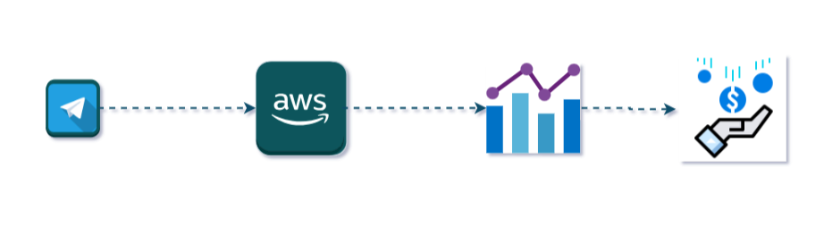
<h2 id="ingestao">2.Ingestão</h2>

<h3 id="aws-s3">2.1. AWS S3</h3>

Nosso primeiro passo foi criar um bucket no AWS S3, batizado de <code>mod-42-ebac-datalake-raw</code>, destinado ao armazenamento de dados crus. Este bucket é onde todas as mensagens coletadas do Telegram são inicialmente armazenadas em seu formato bruto.

<h3 id="aws-lambda">2.2. AWS Lambda</h3>

Para processar as mensagens do Telegram, desenvolvemos uma função Lambda chamada <code>mod-42-ebac-datalake-raw</code>. Essa função recebe as mensagens via AWS API Gateway e as salva no bucket de dados crus do S3 em formato JSON. As variáveis de ambiente e permissões necessárias foram configuradas para garantir que a função Lambda possa interagir com o S3.

<h3 id="aws-api-gateway">2.3. AWS API Gateway</h3>

Criamos uma API no AWS API Gateway, que serve como o ponto de entrada para as mensagens do Telegram, garantindo que todas as mensagens sejam recebidas e processadas de forma eficiente pela função Lambda.

<h3 id="telegram">2.4. Telegram</h3>

No telegram ao concluir todas as etapas iniciais:
    <ol>
  <li>Crie uma conta no Telegram. Caso não possua uma, faça o login na versão web da ferramenta através do link <a href="https://web.telegram.org/">https://web.telegram.org/</a>.</li>
  <li>Criar um bot no telegram web.</li>
  <li>Criar um grupo e adicionar o bot.</li>
  <li>Tornar o bot administrador do grupo.</li>
  <li>Desabilitar a opção de adicionar o bot a novos grupos.</li>
  <li>Alimentar diversos tipos de mensagens no grupo (texto, imagem, arquivos, vídeo, áudio, etc.) e as consumir utilizando a API de bots do Telegram gerada.</li>
</ol>

Finalmente configuramos o webhook do bot do Telegram para redirecionar as mensagens para a URL da API do AWS API Gateway, permitindo que as mensagens enviadas ao bot sejam automaticamente capturadas e processadas pelo pipeline.

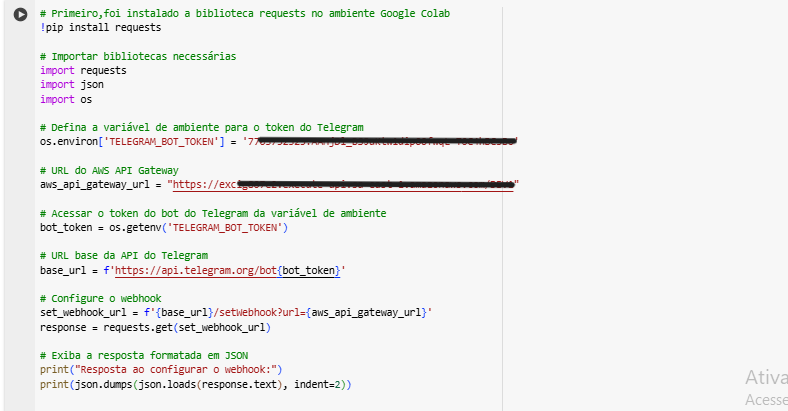
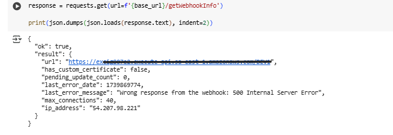

<h4> Arquitetura do Pipeline de Dados com Telegram</h4>

<h2 id="etl">3. ETL (Extract, Transform, Load)</h2>

<h3 id="aws-s3-2">3.1. AWS S3</h3>

Nesta etapa, criamos um novo bucket no AWS S3 chamado <code>mod-42-ebac-datalake-enriched</code> para armazenar os dados enriquecidos, que já passaram por um processo de transformação e estão prontos para análise.

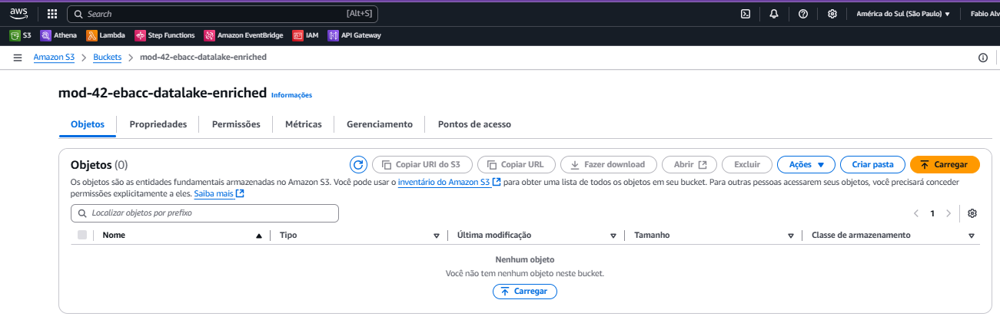
<h3 id="aws-lambda-2">3.2. AWS Lambda</h3>

Desenvolvemos uma segunda função Lambda chamada <code>mod-42-ebac-datalake-enriched2</code>. Esta função processa as mensagens JSON do bucket de dados crus, transforma os dados e os armazena no bucket de dados enriquecidos no formato Parquet.

<h3 id="aws-eventbridge">3.3. AWS EventBridge</h3>

Criamos uma regra no AWS EventBridge para executar a função Lambda diariamente à meia-noite, no horário de Brasília (GMT-3). Essa automação garante que o pipeline de ETL seja executado regularmente, mantendo os dados sempre atualizados.

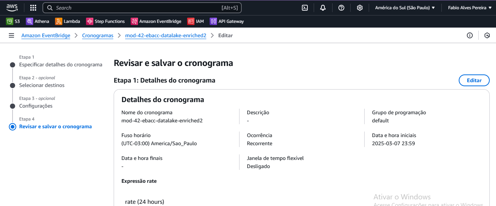

<h2 id="apresentacao">4. Apresentação</h2>

<h3 id="aws-athena">4.1. AWS Athena</h3>

Para apresentar os dados de forma acessível, utilizamos o AWS Athena. Criamos uma tabela externa no Athena que aponta para os dados armazenados no bucket enriquecido do S3. Isso permite que os usuários façam consultas SQL diretamente nos dados transformados.

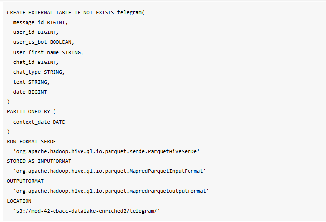

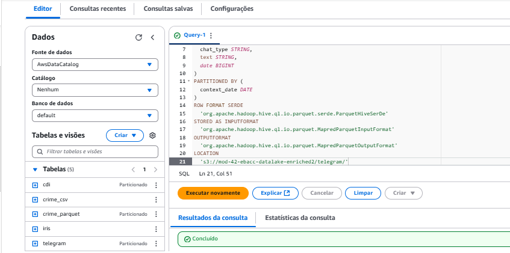

<h3>4.2. MSCK REPAIR TABLE</h3>

Executamos o comando <code>MSCK REPAIR TABLE</code> para carregar as partições da tabela no Athena, garantindo que todos os dados estejam disponíveis para consulta.

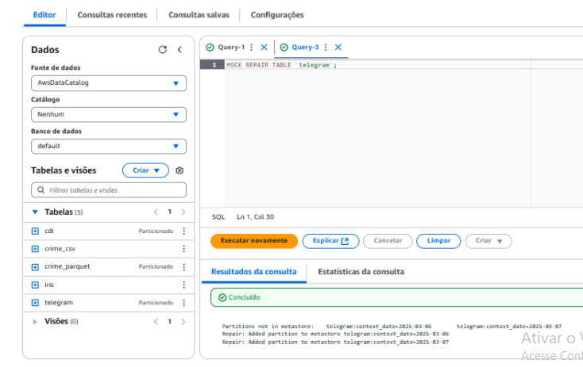

<h3>4.3.Validação dos Dados</h3> 
Após carregar dados na tabela "Telegram", a consulta SELECT * FROM "telegram" permite verificar se todos os dados foram carregados corretamente. É uma maneira rápida de garantir que não houve problemas durante o processo de ETL (Extração, Transformação e Carregamento).

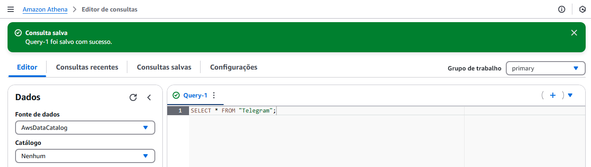

O resultado da consulta é exibido na página do <strong>serviço Athena</strong> da seguinte maneira:

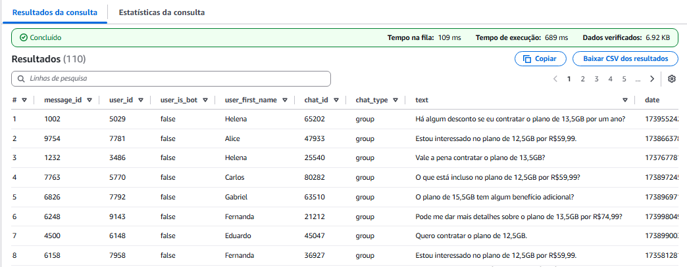

<h2>4.4. Análise de Dados</h2>

Utilizamos consultas SQL no Athena para explorar os dados e gerar insights. Essas consultas nos permitem entender padrões de comportamento, como horários de maior interação e conteúdo das mensagens, auxiliando na tomada de decisões estratégicas.

<strong>Query-1:</strong> Segmentação por Plano de Internet

<strong>Objetivo:</strong> Esta consulta conta o número de mensagens que mencionam cada tipo de plano de internet, ajudando a identificar quais planos são mais populares entre os usuários.

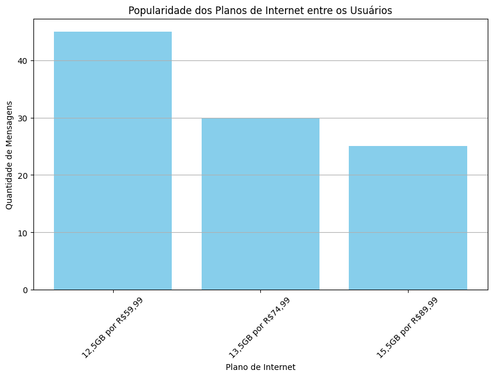

<h2>Insights</h2>

    Ao analisar o gráfico, <strong>é evidente que o plano de 12,5GB por R$59,99 é o mais popular entre os usuários</strong>, com a maior quantidade de mensagens mencionando este plano. Isso indica uma preferência clara pelo plano mais acessível em termos de custo-benefício.

    Os planos de <code>13,5GB por R$74,99 e 15,5GB por R$89,99</code> têm menos menções, sugerindo que os usuários são mais atraídos pelo plano mais barato, mesmo que ofereça uma quantidade menor de dados.

<strong>Query-2:</strong> Horários de Pico de Interesse

<strong>Objetivo:</strong> Esta consulta analisa os horários em que os usuários mencionam interesse em planos de internet, permitindo identificar os melhores momentos para campanhas de marketing.

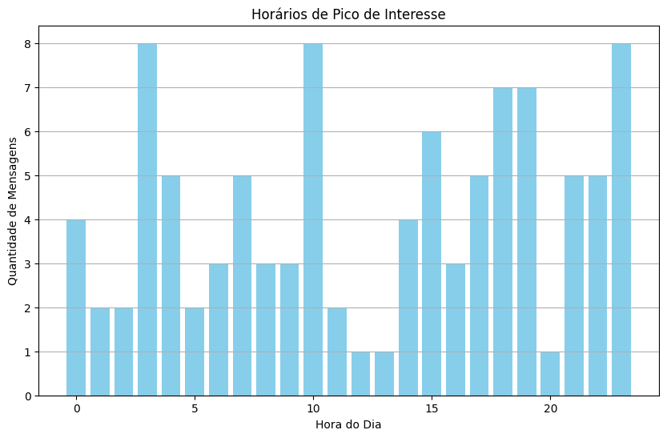

<h2>Insights</h2>
<ul>
  <li><strong>Picos de Mensagens:</strong> As horas com maior quantidade de mensagens são:
    <ul>
      <li><strong>3 AM:</strong> 8 mensagens</li>
      <li><strong>10 AM:</strong> 8 mensagens</li>
      <li><strong>23 PM:</strong> 8 mensagens</li>
    </ul>
  </li>
  <li><strong>Outros Horários Relevantes:</strong> Existem picos secundários em:
    <ul>
      <li><strong>18 PM e 19 PM:</strong> Com 7 mensagens cada</li>
      <li><strong>4 AM, 7 AM, e 17 PM:</strong> Com 5 mensagens cada</li>
    </ul>
  </li>
  <li><strong>Baixa Atividade:</strong> Os períodos com menor atividade são entre 1 AM, 2 AM, 5 AM e 11 AM, com apenas 2 mensagens.</li>
  <li><strong>Baixa Atividade:</strong> Os períodos com o mínimo de atividade são entre 12 AM, 13 PM, e 20 PM, com apenas 1 mensagem.</li>
</ul>

<strong>Query-3:</strong> Dias de Maior Atividade

<strong>Objetivo:</strong> Esta consulta conta o número de mensagens enviadas em cada dia da semana, ajudando a identificar os dias de maior atividade dos usuários e planejando campanhas de acordo.

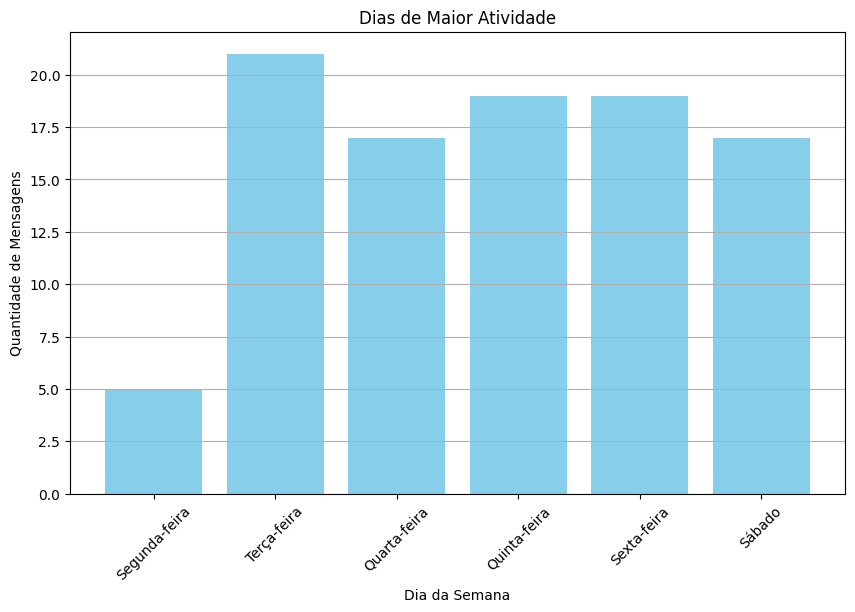

<h2>Insights</h2>
<ul>
  <li><strong>Picos de Atividade:</strong>
    <ul>
      <li><strong>Terça-feira, Quinta-feira e Sexta-feira:</strong> Estes dias são os mais ativos, com aproximadamente 20 mensagens cada.</li>
      <li><strong>Quarta-feira e Sábado:</strong> Apresentam uma alta atividade, com cerca de 17 mensagens cada.</li>
      <li><strong>Segunda-feira:</strong> É o dia com a menor atividade, registrando apenas 5 mensagens.</li>
    </ul>
  </li>
</ul>

<strong>Query-4:</strong> Engajamento por Usuário

<strong>Objetivo:</strong> Esta consulta identifica os usuários mais engajados, permitindo ações de marketing direcionadas a esses usuários para aumentar ainda mais o engajamento e a fidelidade.

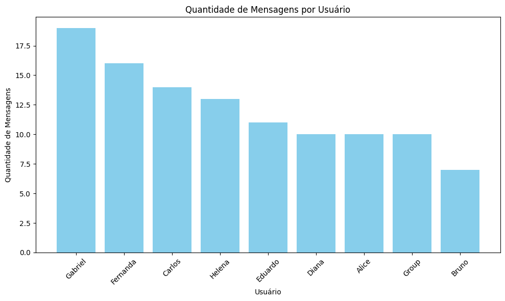

<h2>Insights</h2>
<ul>
  <li><strong>Usuários Altamente Engajados:</strong>
    <ul>
      <li><strong>Gabriel e Fernanda:</strong> São os mais engajados, com Gabriel liderando em número de mensagens. Isso demonstra alta participação e potencial para influenciar as discussões do grupo.</li>
    </ul>
  </li>
  <li><strong>Usuários Menos Participativos:</strong>
    <ul>
      <li><strong>Bruno e Group:</strong> Apresentam baixos níveis de interação, indicando possível desinteresse ou desconexão com os tópicos abordados.</li>
    </ul>
  </li>
  <li><strong>Distribuição de Engajamento:</strong>
    <ul>
      <li>Há uma diferença significativa entre os mais e menos ativos, mostrando que o engajamento depende de um grupo pequeno de usuários.</li>
    </ul>
  </li>
</ul>

<strong>Query-5:</strong> Mensagens por Tipo de Plano e Hora do Dia

<strong>Objetivo:</strong> Esta consulta combina a análise de interesse por tipo de plano de internet com a hora do dia, ajudando a entender quando os usuários estão mais propensos a discutir sobre planos específicos.

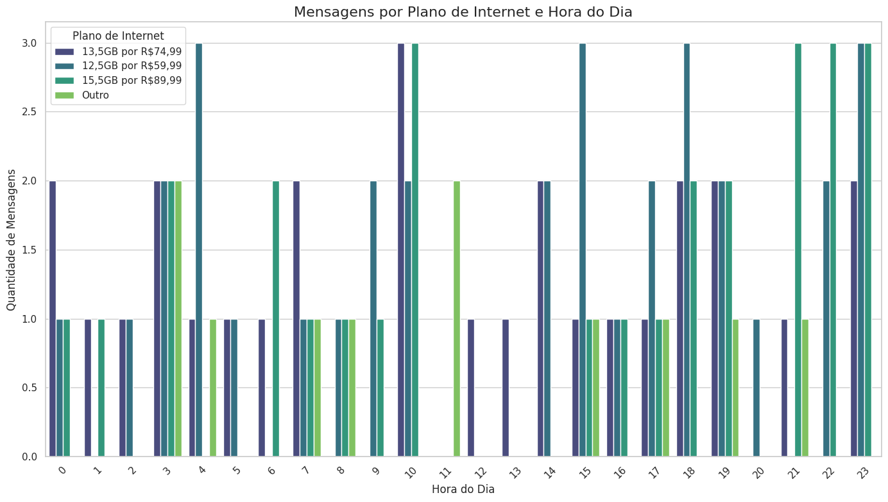

<h2>Insights</h2>
<ul>
  <li><strong>Picos de Discussão:</strong>
    <ul>
      <li><strong>Entre 12h e 15h:</strong> Este é o período de maior atividade para mensagens sobre os planos de internet, independentemente do tipo de plano.</li>
      <li><strong>Período de Menor Atividade:</strong> Horários noturnos, como após as 22h, apresentam pouca ou nenhuma discussão sobre planos.</li>
    </ul>
  </li>
  <li><strong>Popularidade por Tipo de Plano:</strong>
    <ul>
      <li><strong>13,5GB por R$74,99:</strong> Este plano é o mais discutido durante o dia.</li>
      <li><strong>12,5GB por R$59,99:</strong> Recebe atenção moderada, com destaque próximo ao meio-dia.</li>
      <li><strong>15,5GB por R$89,99:</strong> Embora menos popular que os anteriores, há discussões consistentes durante a tarde.</li>
      <li><strong>Outro:</strong> Planos classificados como "outro" têm menor relevância, mas ainda são mencionados no final da tarde.</li>
    </ul>
  </li>
</ul>

<strong>Query-6:</strong> Mensagens Negativas e Positivas

<strong>Objetivo:</strong> Esta consulta classifica as mensagens dos usuários como positivas ou negativas com base em palavras-chave, ajudando a entender melhor a percepção dos usuários sobre os planos de internet.

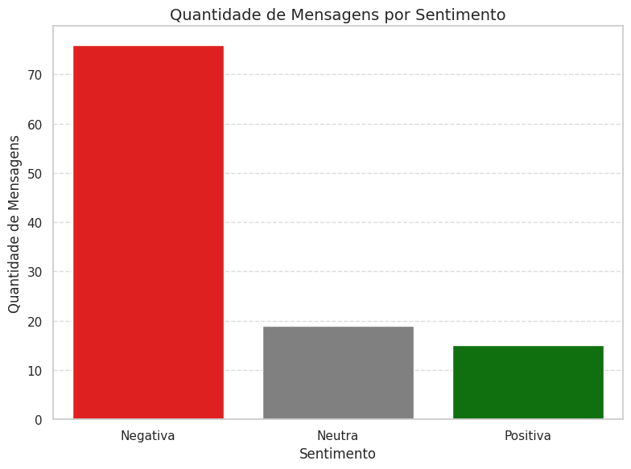

<h2>Insights</h2>
<ul>
  <li><strong>Predominância de Sentimentos Negativos:</strong>
    <ul>
      <li>Mais de 70 mensagens foram classificadas como negativas, o que indica uma percepção majoritariamente insatisfatória dos usuários em relação aos planos de internet.</li>
    </ul>
  </li>
  <li><strong>Sentimentos Neutros:</strong>
    <ul>
      <li>Mensagens neutras representam cerca de 20 interações, apontando para uma abordagem mais descritiva ou informativa, sem opinião clara sobre os planos.</li>
    </ul>
  </li>
  <li><strong>Baixo Índice de Mensagens Positivas:</strong>
    <ul>
      <li>Com apenas 15 mensagens positivas, há um indicativo de pouca satisfação ou entusiasmo dos usuários com relação aos serviços oferecidos.</li>
    </ul>
  </li>
</ul>

<strong>Query-7:</strong> Análise de Retenção de Usuários

<strong>Objetivo:</strong> Esta consulta identifica a frequência com que os mesmos usuários mencionam planos de internet, ajudando a analisar a retenção de clientes.

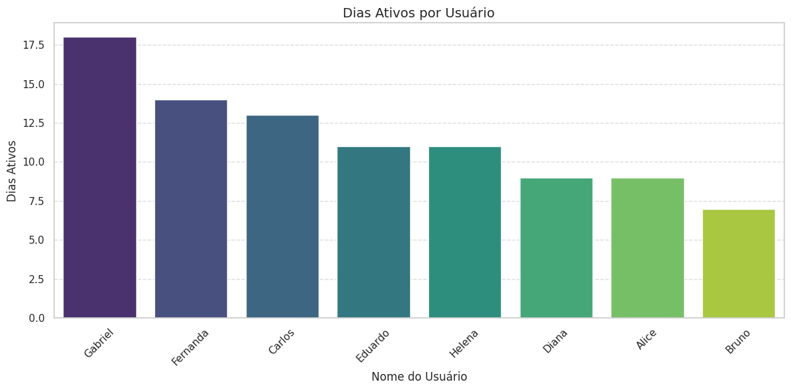

<h2>Insights</h2>
<ul>
  <li><strong>Usuários Altamente Retidos:</strong>
    <ul>
      <li><strong>Gabriel e Fernanda:</strong> Têm o maior número de dias ativos, o que demonstra um alto nível de retenção e engajamento com o tema de planos de internet.</li>
    </ul>
  </li>
  <li><strong>Usuários Moderadamente Retidos:</strong>
    <ul>
      <li><strong>Carlos, Eduardo, Helena e Diana:</strong> Apresentam retenção moderada, com participação ativa em vários dias, mas ainda abaixo dos líderes Gabriel e Fernanda.</li>
    </ul>
  </li>
  <li><strong>Usuários com Baixa Retenção:</strong>
    <ul>
      <li><strong>Bruno:</strong> É o usuário com o menor número de dias ativos, indicando que pode haver falta de interesse ou desengajamento.</li>
    </ul>
  </li>
</ul>

<strong>Query-8:</strong> Mensagens mais frequentes no chat

<strong>Objetivo:</strong> Essa consulta busca entender padrões de comportamento, interesses e linguagens comuns entre os usuários.

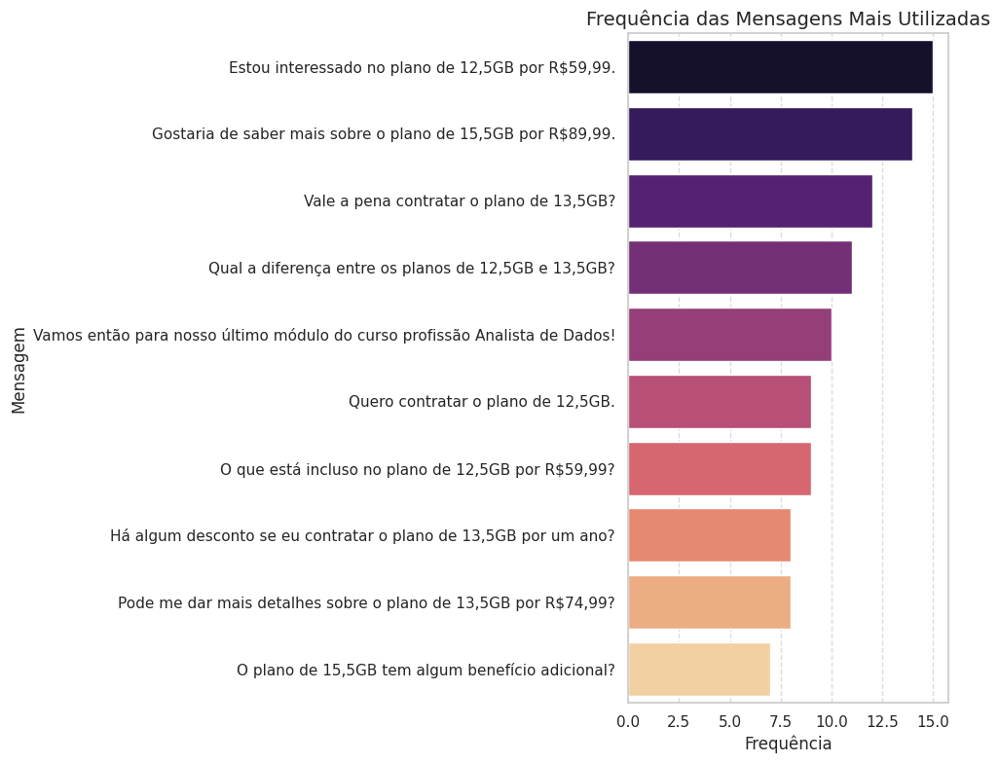

<h2>Insights</h2>
<ul>
  <li><strong>Padrões de Interesse:</strong>
    <ul>
      <li><strong>Planos de Internet:</strong> A maior parte das mensagens gira em torno de planos específicos, como o de 12,5GB (R$59,99) e 13,5GB (R$74,99), evidenciando um grande interesse em detalhes e comparações entre as opções.</li>
      <li><strong>Consulta por Benefícios:</strong> Mensagens como "O plano de 15,5GB tem algum benefício adicional?" demonstram que os usuários buscam mais do que informações básicas, procurando por vantagens extras.</li>
    </ul>
  </li>
</ul>

<h2 id="conclusao">5.Conclusão</h2>

O projeto "Pipeline de Dados com Telegram" mostra como é possível coletar, processar e apresentar dados de maneira eficiente utilizando serviços da AWS. Desde a ingestão automática de dados do Telegram até o processamento e armazenamento dos dados enriquecidos, o pipeline fornece uma solução robusta e escalável para a análise de dados em tempo real.

</body>
</html>
